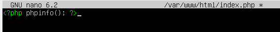

# Instal·lació Moodle

## Creació màquina virtual

- Primer de tot, posarem "adaptador pont" a la màquina i li posarem la iso de ubuntu server.


## Instal·lació Moodle

1. Primer de tot posarem la comanda "ssh (usuari@IP)"

```
shh gprades@192.168.203.224
```


4. Instal·larem l'apache


5. Instal·larem MariaDB


6. Ara insta·larem la configuració de seguretat de mysql


7. Comprovem que podem entrar


8. Instal·larem el php7.3. Per fer-ho haurem d'instal·lar diferents coses.


9. Seguidament editarem el següent fitxer per a que ens mostre index.php enves de index.html.


10. Reiniciarem el servidor apache per a que s'aguardin tots els canvis.


11. Finalment veurem l'estat del servidor apache fent un status.


12. Crearem el fitxer index.php




13. Seguidament instal·larem el moodle amb la següent comanda:


14. Descomprimirem la carpeta


15. Canviarem els permisos


16. Entrarem al directori /home, crearem la carpeta "moodledata" i li donarem permisos.


17. Accedirem a la base de dades amb mode root.


18. Crearem l'usuari moodlemanager dins de la base de dades.


19. Crearem la base de dades de moodle.


20. Li donarem permisos a l'usuari.


21. Entrarem al buscador i posarem (la nostra ip)/moodle


22. Escollirem l'idioma català.


23. Ens sortiràn aquests errors i els haurem de solucionar.


24. Entrarem al directori /var/www/html/moodle i instal·larem el php 7.3


25. Farem el mateix per al zip


26. Tornarem a recargar el servidor


27. Ja estarem dins i ens demanarà que li possesim el directori de dades, en el meu cas li posarem /home/moodle


28. Ens demanarà la base de dades que hem utilitzat, en el nostre cas és MariaDB


